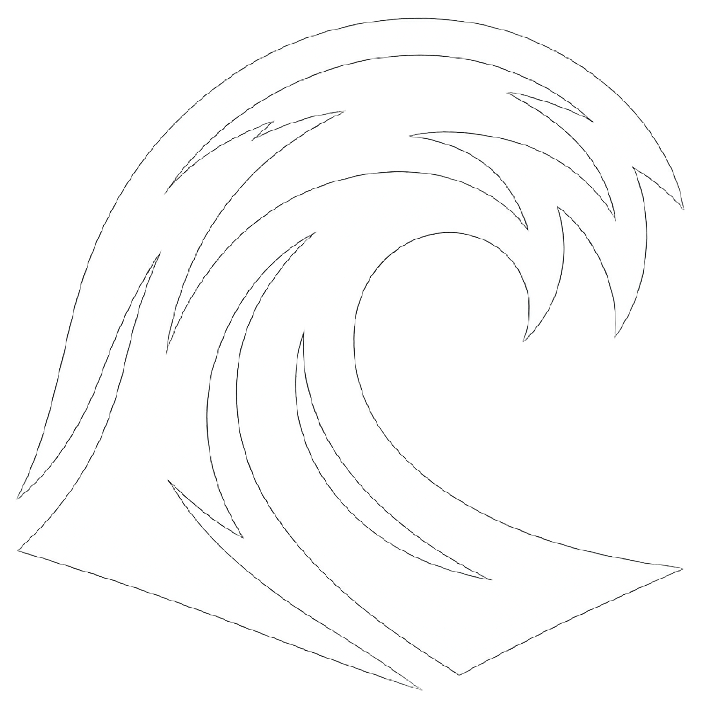

# Ekman Transport Visualizer

An educational web-based simulation tool for visualizing oceanographic phenomena and exploring wind-ocean current interactions based on Ekman transport theory.



## Features

- 🌊 **3D & 2D Visualization**: Interactive 3D and 2D plots of Ekman transport
- 🌬️ **Wind Stress Analysis**: Calculate and visualize wind stress effects on ocean currents
- 📊 **Interactive Charts**: Powered by Plotly.js for rich, interactive visualizations
- 📱 **Responsive Design**: Optimized for desktop, tablet, and mobile devices
- 🌗 **Dark/Light Mode**: Automatic theme switching based on system preferences
- 🌍 **Multi-language Support**: Available in English, Korean, Chinese, Japanese, Spanish, and Russian
- ⚡ **Preset Configurations**: Quick setup with predefined wind condition presets (Normal, Strong Wind, Typhoon)
- 💾 **Export Results**: Download calculation results as JSON files
- 🎯 **Location Selection**: Pre-configured locations including Los Angeles, Busan, North Pacific, North Atlantic, Southern Ocean, and Equator

## Getting Started

### Prerequisites

No installation required! This is a pure HTML/CSS/JavaScript application that runs directly in your web browser.

### Usage

1. Open `index.html` in any modern web browser
2. Adjust the parameters:
   - **Wind Speed** (0-30 m/s): Speed of the wind
   - **Wind Direction** (0-360°): Direction of the wind
   - **Latitude** (-90° to 90°): Geographic latitude
   - **Depth** (10-500m)**: Ocean depth for analysis
3. Choose visualization type (3D or 2D)
4. Click **Calculate & Visualize** to generate results
5. View the interactive charts and calculation results
6. Export results as JSON if needed

### Quick Presets

- 🌤️ **Normal**: Regular wind conditions (10 m/s)
- 💨 **Strong Wind**: Strong wind conditions (20 m/s)
- 🌪️ **Typhoon**: Extreme wind conditions (30 m/s)

## Technical Details

### Technologies Used

- **HTML5**: Structure and semantic markup
- **CSS3**: Styling with CSS variables and responsive design
- **JavaScript (ES6+)**: Core functionality and calculations
- **Plotly.js**: Interactive data visualization library

### Physics Background

The application implements the Ekman transport theory, which describes the net mass transport of water due to wind stress and the Coriolis effect. Key calculations include:

- **Wind Stress**: Force per unit area exerted by wind on the ocean surface
- **Coriolis Parameter**: Effect of Earth's rotation on moving water
- **Ekman Spiral**: The spiral pattern of ocean currents with depth
- **Ekman Transport**: Net water transport perpendicular to wind direction
- **Energy Transfer**: Rate of energy transfer from wind to ocean currents

### File Structure

```
Ekman-Transport-main/
├── index.html          # Main HTML file
├── style.css          # All CSS styles
├── app.js             # All JavaScript functionality
├── logo/
│   ├── dark.png       # Dark mode favicon
│   └── white.png      # Light mode favicon
└── README.md          # This file
```

## Browser Support

- Chrome (recommended)
- Firefox
- Safari
- Edge

## License

MIT License - Free to use, modify, and distribute

## Author

Pistolinkr

## Links

- 🌐 **Website**: [ekman-transport.store](https://ekman-transport.store)
- 📧 **Email**: pistolinkr@icloud.com
- 💻 **GitHub**: [pistolinkr/Ekman-Transport](https://github.com/pistolinkr/Ekman-Transport)

## Acknowledgments

- Built using Plotly.js for visualization
- Based on Ekman transport theory from oceanography research

